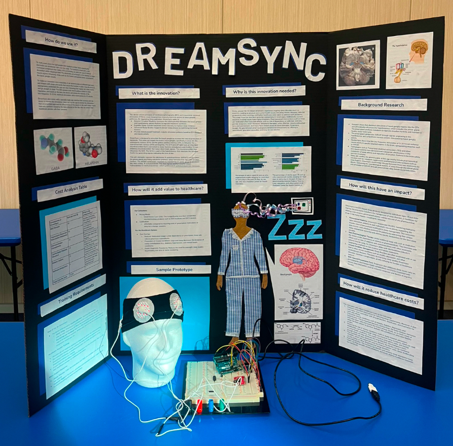
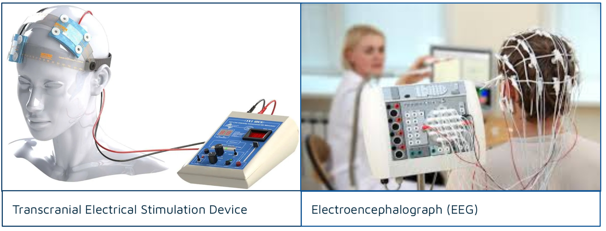
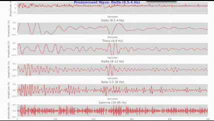

# What is ***DreamSync?***


Essentially, this device utilizes principles of electroencephalography (EEG) and transcranial electrical stimulation (TES) to create targeted low-intensity electrical pulses to basal ganglia pathways. By regulating these pathways, DreamSync seeks to:
- **Balance Circadian Rhythms:** Increases the communication between the basal ganglia and hypothalamic-pineal rhythms to regulate melatonin synthesis. 
- **Expedite Sleep:** Elevate melatonin levels naturally to improve sleep initiation. 
- **Advanced Sleep Quality:** Supports deeper sleep phases by optimizing hormonal balance. 
- **Provide Individualized Treatment:** Adjusts simulation patterns based on EEG feedback and neural activity.
  
 

# Key Components of DreamSync

**Software Butterworth Bandpass Filter Algorithm:** Used to allow signals within a specific frequency range (0.5–47 Hz) to pass through with minimal signal distortion. 

**Breadboard:** A platform for connecting the prototype and components without soldering. 

**Jumper Cables:** Enable connections between components on the breadboard and to the Arduino for signal flow. 

**AD8232 ECG Sensor with 3-Channel Electrodes:** Amplifies and filters bioelectric signals from the body, making them suitable for processing. 

**Arduino Uno 3:** A microcontroller that processes the signals and sends data to a connected device for analysis. 

**ADS1115 Analog-to-Digital Converter:** Converts the analog signals from the AD8232 into digital form for precise data capture. 

## Future Implementations

**TL074 Amplifier with High (47 Hz) and Low (0.5 Hz) Band Filters:** Provides additional amplification and filtering for cleaner signal output. 

**TES & EEGNet AI Model Integration:** Processes EEG signal data through a convolutional neural network to analyze brainwave patterns.


# How does DreamSync function?

1. **Setup and Powering On:** Wear the DreamSync headband as seen on model and ensure all components (Arduino, ADS1115, AD8232, TL074) are properly connected to the breadboard and powered via a USB connection or battery.
   
3. **Signal Detection:** The electrodes capture faint electrical signals generated by neural activity in your brain. Signal Amplification and Filtering: The AD8232 module amplifies these signals and filters out noise, ensuring they are clear enough for further processing.
   
5. **Signal Conditioning:** The TL074 op-amp provides additional amplification and fine-tunes the signals for optimal quality. Analog-to-Digital Conversion: The processed analog signals are sent to the ADS1115, which converts them into precise digital data.
   
7. **Data Processing:** The Arduino receives the digital signals, applies algorithms (e.g., Butterworth bandpass filtering), and organizes the data for analysis. Data Analysis with AI: The processed EEG data is analyzed by the EEGNet AI model, which identifies patterns in brain activity, such as those associated with sleep states.
   
9. **Real-Time Feedback Loop:** The system continuously monitors brain signals and adjusts stimulation parameters to align with the user's current sleep-related brain state. Impact on the Brain: The tDCS stimulation encourages activity in neural circuits linked to sleep regulation, promoting deeper, more restful sleep by calming overactive regions and enhancing relaxation.

# The Science Inside Our Brains

DreamSync targets the brain’s basal ganglia, specifically in areas like the subthalamic nucleus (STN) and the globus pallidus internus (GPi), to influence the suprachiasmatic nucleus (SCN) contingently. 
The STN and GPi both have an important neurotransmitter that is connected to sleep: Gamma-aminobutyric acid (GABA).
GABA = an inhibitory neurotransmitter that slows down brain signals. This neurotransmitter then influences the SCN. 
SCN is a part of the hypothalamus that regulates the circadian rhythm by generating signals indicating the time of day. 
This will ultimately regulate the alkylamine N-acetyltransferase (ANNAT) activity within the pineal gland, promoting melatonin synthesis (a key hormone that regulates circadian rhythm). 
The ANNAT synthesizes melatonin by transferring an acetyl group to serotonin; this then creates  N-acetylserotonin. This then signals another enzyme called hydroxyindole-O-methyltransferase, which synthesizes N-acetylserotonin into melatonin.

" alt="Project Screenshot" width="1000">

## The final product of EEG sensoring:


## Step-By-Step

```
import serial
import numpy as np
import matplotlib.pyplot as plt
from matplotlib.animation import FuncAnimation
from scipy.signal import butter, lfilter
```

# Serial port configuration
```
SERIAL_PORT = "COM3"  # Replace with your Arduino's COM port
BAUD_RATE = 9600
WINDOW_SIZE = 500  # Number of samples for real-time plotting
SAMPLING_RATE = 100  # Hz (adjust to your actual sampling rate)
```

# Initialize serial connection
```
ser = serial.Serial("/dev/tty.usbmodem1101", BAUD_RATE, timeout=1)
```

# Butterworth Bandpass Filter
```
def butter_bandpass(lowcut, highcut, fs, order=4):
    nyquist = 0.5 * fs
    low = lowcut / nyquist
    high = highcut / nyquist
    b, a = butter(order, [low, high], btype="band")
    return b, a

def bandpass_filter(data, lowcut, highcut, fs, order=4):
    b, a = butter_bandpass(lowcut, highcut, fs, order)
    return lfilter(b, a, data)
```

# Band configurations
```
bands = {
    "Delta (0.5-4 Hz)": (0.5, 4),
    "Theta (4-8 Hz)": (4, 8),
    "Alpha (8-13 Hz)": (8, 13),
    "Beta (13-30 Hz)": (13, 30),
    "Gamma (30-45 Hz)": (30, 45),
}
```
# Initialize data buffers
```
raw_data = np.zeros(WINDOW_SIZE)
band_data = {name: np.zeros(WINDOW_SIZE) for name in bands}
band_power = {name: 0 for name in bands}
```
# Setup plots
```
plt.style.use("ggplot")
fig, axes = plt.subplots(len(bands) + 1, 1, figsize=(10, 10), sharex=True)
```

# Raw EEG plot
```
axes[0].set_title("Raw EEG Signal")
axes[0].set_ylim(-3, 3)
raw_line, = axes[0].plot(raw_data)
```

# Band-specific plots
```
band_lines = {}
for ax, (name, _) in zip(axes[1:], bands.items()):
    ax.set_title(name)
    ax.set_ylim(-0.5, 0.5)
    band_lines[name], = ax.plot(band_data[name])
```

# Predominant wave label
```
fig.text(0.5, 0.95, "", ha="center", fontsize=16, fontweight="bold", color="blue")

def update(frame):
    global raw_data, band_data, band_power

    try:
        serial_input = ser.readline().decode("utf-8").strip()  # Renamed to avoid conflict
        print(serial_input)
        if serial_input:
            raw_adc = int(serial_input)
            voltage = raw_adc * (4.096 / 32768)  # Convert raw ADC to voltage

            # Update raw data buffer
            raw_data = np.roll(raw_data, -1)
            raw_data[-1] = voltage

            # Update band-specific buffers and calculate power
            for name, (lowcut, highcut) in bands.items():
                band_data[name] = np.roll(band_data[name], -1)
                band_data[name][-1] = bandpass_filter(raw_data, lowcut, highcut, SAMPLING_RATE)[-1]

                # Calculate RMS power for the band
                band_power[name] = np.sqrt(np.mean(np.square(band_data[name])))

            # Update raw EEG plot
            raw_line.set_ydata(raw_data)  # Correct reference to the plot line

            # Update band-specific plots
            for name, line in band_lines.items():
                line.set_ydata(band_data[name])

            # Determine the predominant wave
            predominant_band = max(band_power, key=band_power.get)
            fig.texts[-1].set_text(f"Predominant Wave: {predominant_band}")

    except ValueError:
        pass  # Ignore invalid lines

    return [raw_line] + list(band_lines.values())
```

# Adjust plot settings
```
for ax in axes:
    ax.set_xlim(0, WINDOW_SIZE)
    ax.set_xlabel("Samples")
    ax.set_ylabel("Amplitude (V)")
```

# Initialize animation
```
ani = FuncAnimation(fig, update, blit=True, interval=50)
plt.tight_layout()
plt.show()
```

# Close serial connection
```
ser.close()
```
